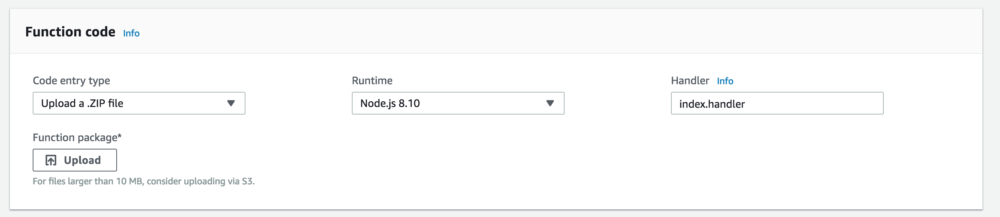

# Happy Button

Push the button to text yourself (or others) a motivational quote.

Uses [Amazon Web Services](https://aws.amazon.com) and [Forismatic](https://forismatic.com/en/) quote API.

I used an [esp32 dev board](https://www.espressif.com/en/products/hardware/esp32-devkitc/overview). An esp8266 would work fine too.

This is a simple mod to the [AWS IoT button project](https://github.com/mongoose-os-apps/aws-iot-button) from Mongoose OS. But their button is lame because it just texts/emails you "Button Pressed".

Wanna jazz it up?

Just follow the tutorial and get your button working. Then
1. Grab the random_quote_package.zip from this repo
2. Go to the [AWS Console](https://aws.amazon.com), and find the lambda function for your project.
3. Go to the function code panel, and in the dropdown menu under "Code Entry Type", choose "Upload a .ZIP File"
4. Upload random_quote_package.zip as your function package, save, and voila!

